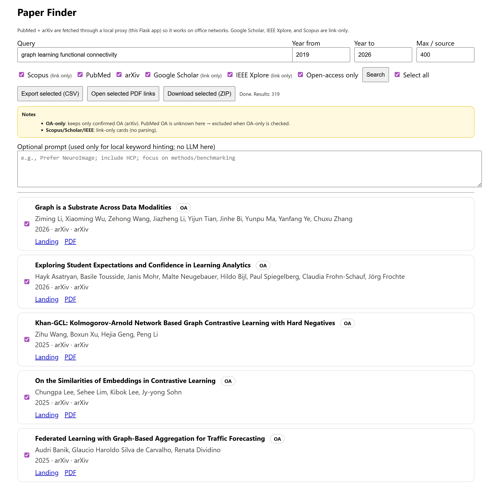
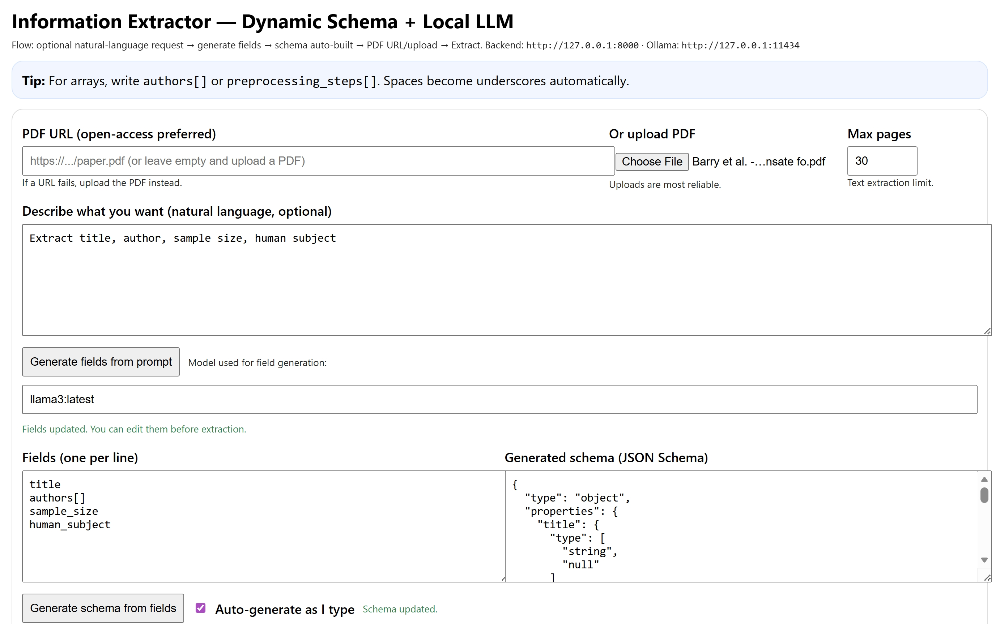
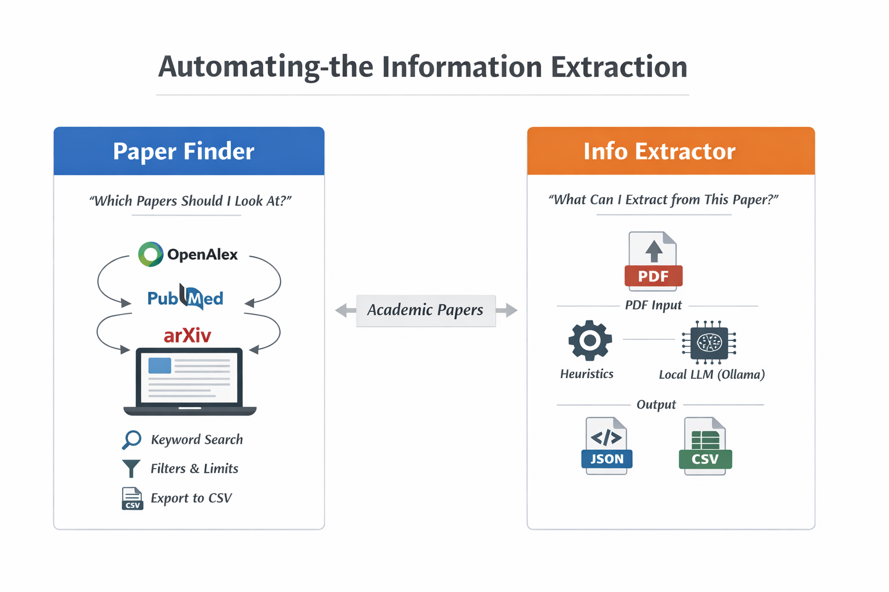

# Automating-the-Information-Extraction

This repository contains **two independent but complementary tools** for academic workflows:

- **Paper Finder** — for *discovering and shortlisting* relevant research papers from multiple scholarly platforms.
- **Info Extractor** — for *extracting structured information* from a **specific paper (PDF)** based on a user-defined schema, using heuristics and optionally a local LLM (Ollama).

The tools are deliberately separated:
- **Paper Finder** answers *“Which papers should I look at?”*
- **Info Extractor** answers *“What information can I extract from this paper?”*

---

## Repository Structure

```Automating-the-Information-Extraction/
├── paper-finder/                 # Literature search GUI
│   ├── search.html               # Browser-based interface
│   └── server.py                 # Flask backend (PubMed/arXiv proxy)
│
├── classification/               # Paper relevance classification module
│   └── Classification.ipynb      # Notebook for classifying relevant vs irrelevant papers
│
└── info-extractor/               # Information extraction module
    ├── backend/
    │   └── server.py             # Extraction API
    └── frontend/
        └── extractor_ui.html     # Extraction GUI
```

---

# 🔍 Paper-Finder

GUI-based tool for discovering, reviewing, and exporting academic papers across multiple databases.


---

## Overview

Paper-Finder is a lightweight, browser-based graphical user interface (GUI) that simplifies the process of searching for academic literature across multiple sources. It is designed for researchers who want a fast, transparent, and reproducible way to explore papers without relying on command-line tools or proprietary platforms.

The tool combines a local Flask backend (for reliable API access) with a clean HTML/JavaScript frontend, making it suitable for office networks, teaching environments, and collaborative research workflows.

Paper-Finder is especially useful as an early-stage literature discovery tool, before moving into systematic screening or automated review pipelines.

---

## Key Features

### ✅ Implemented Features

#### Multi-Source Search
- PubMed (via local proxy)
- arXiv (via local proxy)
- Google Scholar (link-only)
- IEEE Xplore (link-only)
- Scopus (link-only)

#### Graphical User Interface
- Runs entirely in the browser
- No command-line interaction required after setup
- Clear visual presentation of results

#### Year-Filtered Search
- Specify start and end publication years
- Filters applied consistently across sources

#### Open-Access Filtering
- Restrict results to confirmed open-access papers (currently arXiv)

#### Selection & Batch Actions
- Per-paper checkboxes
- “Select all” toggle with correct indeterminate state
- Batch export and download actions

#### Export Options
- Export selected papers to CSV
- Open all available PDF links in browser tabs
- Download selected papers as a ZIP archive, including:
  - Metadata CSV
  - Links file
  - PDFs (where available, e.g., arXiv)

#### Office-Network Friendly
- PubMed and arXiv requests are routed through a local Flask server
- Avoids common corporate firewall issues

---

## Main Capabilities

### Unified Discovery Interface
Search multiple academic sources from a single screen.

### Transparent Metadata Handling
Titles, authors, year, venue, source, open-access status, and links are clearly exposed.

### Manual Review Support
Designed for human-in-the-loop exploration rather than opaque automation.

### Reproducible Outputs
CSV and ZIP exports can be version-controlled or shared with collaborators.

---

## Getting Started

### Requirements
- Python 3.9+
- Internet access
- Modern web browser (Chrome, Firefox, Edge)

### Installation

Clone the repository:
```bash
git clone [https://github.com/sanahassanimam/Automating-the-Information-Extraction]
cd Automating-the-Information-Extraction/Paper-Finder
```

Install Python dependencies:
```bash
pip install flask requests
```

Start the local server:
```bash
python server.py
```

Open your browser and navigate to:
```
http://127.0.0.1:5174/search.html
```

That’s it — no additional setup required.

---

## How It Works

### Architecture

**Frontend**
- Plain HTML, CSS, and JavaScript
- No frameworks or build steps
- Runs entirely in the browser

**Backend**
- Flask server (`server.py`)
- Proxies PubMed and arXiv requests
- Generates ZIP exports server-side

### Data Flow
1. User submits a query via the GUI
2. Flask backend fetches results from PubMed and/or arXiv
3. Link-only sources generate direct search URLs
4. Results are merged and displayed in the browser
5. User selects papers and exports data as needed

---

## Exported Data

### CSV Export

The CSV file includes:
- Title
- Authors
- Publication year
- Venue / journal
- DOI (if available)
- Source database
- Open-access status
- PDF URL
- Landing page URL

This format is suitable for:
- Spreadsheet analysis
- Screening tools
- Downstream automation pipelines

### ZIP Export

The ZIP archive contains:
- `selected_papers.csv`
- `links.txt` (human-readable overview)
- `pdfs/` directory (when PDFs are available)
- `zip_log.txt` (summary of downloaded PDFs)

---

## Comparison with Other Tools

| Feature | Paper-Finder | CLI / Python Tools | Publisher Websites |
|------|-------------|------------------|-------------------|
| Interface | GUI (Browser) | Command-line | Web |
| Ease of Use | ⭐⭐⭐⭐⭐ | ⭐⭐ | ⭐⭐⭐ |
| Transparency | ⭐⭐⭐⭐⭐ | ⭐⭐⭐⭐ | ⭐⭐ |
| Automation | ⭐⭐⭐ | ⭐⭐⭐⭐⭐ | ⭐ |
| Reproducibility | ⭐⭐⭐⭐ | ⭐⭐⭐⭐⭐ | ⭐ |
| Setup Overhead | ⭐⭐⭐⭐ | ⭐⭐ | ⭐⭐⭐⭐⭐ |

---

## Use Cases

Paper-Finder is ideal for:
- Exploratory literature searches
- Early-stage systematic reviews
- Teaching literature search strategies
- Collaborative screening sessions
- Non-technical researchers
- Office or university network environments
- Preparing datasets for downstream review tools

---

## Limitations & Notes

- Google Scholar, IEEE Xplore, and Scopus are link-only (no scraping)
- PubMed open-access status is not resolved automatically
- PDF downloads depend on source availability (arXiv works best)
- Not intended as a full systematic review automation engine
---

# 📑 Paper Classification Module

## Overview

The **Classification** module is responsible for automatically distinguishing
**relevant** and **irrelevant** scientific papers after the literature search step.
This serves as an intermediate filtering stage between **paper retrieval**
and **information extraction**, reducing manual screening effort and improving
pipeline efficiency.

The main file in this module is:

- `Classification.ipynb`

---

## Purpose in the Pipeline

This module operates **after Paper Finder** and **before Info Extractor**:

Paper Finder → **Classification** → Information Extractor

Only papers classified as *relevant* are forwarded for structured information
extraction.

---

## File Description

### `Classification.ipynb`

A Jupyter notebook implementing an end-to-end paper classification workflow.

---

## Notebook Structure & Block Summary

### 1️⃣ Imports & Environment Setup
- Loads required Python libraries (e.g., pandas, numpy, sklearn, transformers, etc.)
- Sets random seeds and basic configuration for reproducibility

**Purpose:**  
Prepare the environment for data loading, modeling, and evaluation.

---

### 2️⃣ Data Loading
- Reads metadata and/or extracted text from papers
- Supports CSV, JSON, or preprocessed outputs from the Paper Finder module

**Purpose:**  
Bring paper titles, abstracts, or full text into a structured format suitable for classification.

---

### 3️⃣ Data Preprocessing
- Text cleaning (lowercasing, removing special characters)
- Handling missing values
- Optional text truncation or normalization

**Purpose:**  
Ensure consistent and clean textual input for the classifier.

---

### 4️⃣ Feature Representation
- Converts text into model-ready representations
  - TF-IDF vectors **or**
  - Transformer-based embeddings (if used)

**Purpose:**  
Transform raw text into numerical features that capture semantic information.

---

### 5️⃣ Classification Model
- Implements a relevance classifier
  - Rule-based, classical ML, or LLM-based (depending on configuration)
- Binary output:
  - `Relevant`
  - `Irrelevant`

**Purpose:**  
Automatically decide whether a paper should be kept for further analysis.

---

### 6️⃣ Prediction & Label Assignment
- Applies the trained or loaded model to unseen papers
- Adds a `relevance_label` column to the dataset

**Purpose:**  
Generate machine-readable relevance decisions for downstream modules.

---

### 7️⃣ Evaluation (Optional)
- Computes metrics such as accuracy, precision, recall, or F1-score
- Supports manual inspection of misclassified papers

**Purpose:**  
Assess classification quality and identify systematic errors.

---

### 8️⃣ Output & Export
- Saves classified papers to disk
- Separates relevant and irrelevant papers if required

**Purpose:**  
Provide clean inputs for the Information Extraction module.

---

## Outputs

Typical outputs include:
- Classified CSV/JSON files
- Lists of relevant paper IDs
- Optional logs or evaluation summaries

---
## Block Summary
classification_pipeline:
  block_0:
    title: "Setup & Configuration"
    purpose: "Initialize the classification pipeline"
    description:
      - "Load required libraries and environment settings"
      - "Configure model selection (Local LLM or GPT)"
      - "Define input/output paths and prompt logic"

  block_1:
    title: "Gather & Extract Papers"
    purpose: "Prepare text data for screening"
    description:
      - "Load PDFs from input directories (pdfs1, pdfs2, ...)"
      - "Extract text from PDF files"
      - "Store extracted content in a structured format"

  block_2:
    title: "Screen & Classify Papers"
    purpose: "Run LLM-based relevance screening"
    description:
      - "Use Local LLM (Ollama) or GPT-based model"
      - "Apply prompt-based classification logic"
      - "Process papers individually or in batches"

  block_3:
    title: "Assign Relevance Labels"
    purpose: "Convert model output into classification decisions"
    description:
      - "Assign binary relevance labels"
      - "Relevant or Irrelevant labels derived from prompt responses"

  block_4:
    title: "Review & Analyze Results"
    purpose: "Inspect and validate classification outputs"
    description:
      - "Review papers classified as relevant"
      - "Enable manual inspection and error analysis"
      - "Support iterative refinement of prompts"

  block_5:
    title: "Save Filtered Output"
    purpose: "Export results for downstream analysis"
    description:
      - "Save relevant papers as CSV files"
      - "Export detailed classification metadata"
      - "Prepare clean input for the information extraction module"


---

## Notes

- The notebook is designed to be **modular and extensible**
- Can be adapted to use:
  - Local LLMs (e.g., Ollama)
  - API-based LLMs (if keys are available)
- Supports iterative refinement as classification criteria evolve

---

## Role in Reproducibility

By explicitly documenting classification decisions, this module improves:
- Transparency
- Reproducibility
- Auditability of paper screening decisions


---
## 3. Info Extractor

### Purpose
Info Extractor is a **paper-level information extraction tool**.

You provide:
- a PDF (uploaded locally or via URL)
- a schema describing what to extract

The system returns structured output in JSON and CSV formats.

---

## Extraction Modes

### Heuristics-Based Extraction (Default)
- Regex-based  
- Evidence-driven  
- Transparent and fast  
- Suitable for technical metadata (e.g., sample_size, TR, TE)

### LLM-Assisted Extraction (Optional)
- Uses a local Ollama model  
- Constrained by a JSON Schema  
- Heuristics fill missing or null values  
- No external API calls  

---

## Key Features
- PDF upload or PDF URL input  
- User-defined extraction fields (one field per line)  
- Automatic JSON Schema generation  
- Optional field generation from natural-language prompts  
- Evidence snippets for heuristic matches  
- JSON Schema validation  
- One-click CSV export (single-row output)

---

## How to Run Info Extractor (Local / Windows)

Terminal 1 — Ollama (Optional)

ollama serve

Terminal 2 — Backend (FastAPI)

cd C:\Users\imam\Documents\paper-extractor\info-extractor\backend  
conda activate paperextract  
uvicorn server:app --reload --port 8000  

API root:  
http://127.0.0.1:8000  

API documentation:  
http://127.0.0.1:8000/docs  

Terminal 3 — Frontend (HTML UI)

cd C:\Users\imam\Documents\paper-extractor\info-extractor\frontend  
python -m http.server 5173  

Open in browser:

http://127.0.0.1:5173/extractor_ui.html

---

## Typical Info Extractor Workflow
1. Provide a paper (PDF URL or local upload)
2. Define extraction fields (one per line)
3. Generate the schema
4. Click Extract
5. Review extracted JSON, evidence, and validation output
6. Download the CSV output

---
## **Workflow Overview**



## Extraction Logic
- Heuristics provide evidence-backed values whenever possible.
- If LLM extraction is enabled, LLM output is applied first.
- Missing or null fields are filled using heuristics.
- Final output always conforms to the generated JSON Schema.

---

## Data and Reproducibility Notes
- Do not commit large PDFs or private datasets to GitHub.
- Keep PDFs locally (e.g., in a non-tracked data directory).
- Commit only code, schemas, and small example outputs.

---

## License
See the LICENSE file in this repository.

---

## Contact
Sana Hassan Imam  
GitHub: sanahassanimam
Email:sana.hassan.imam@uni-oldenburg.de
